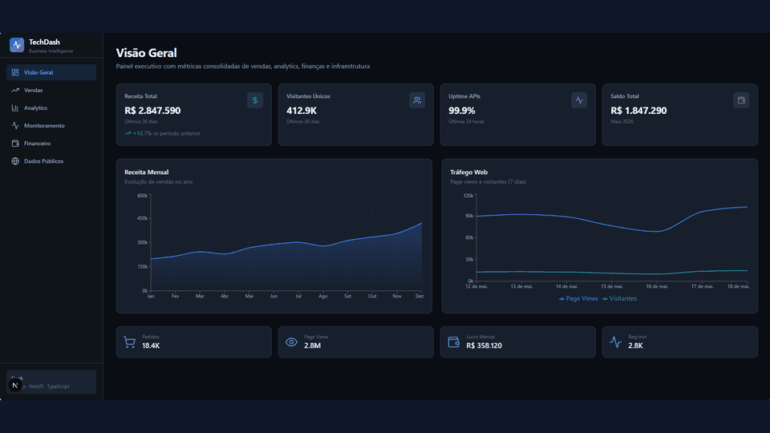
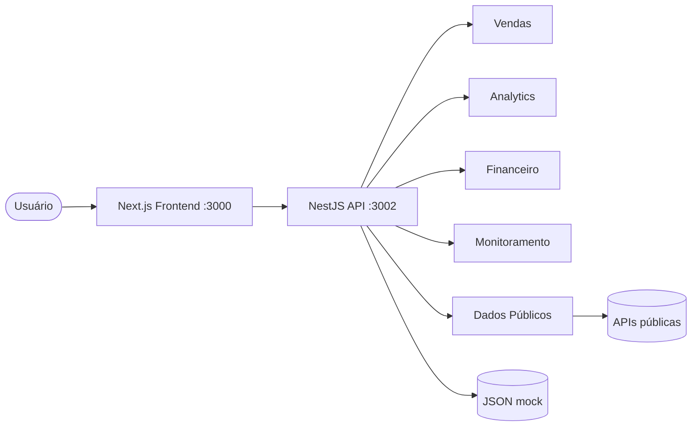
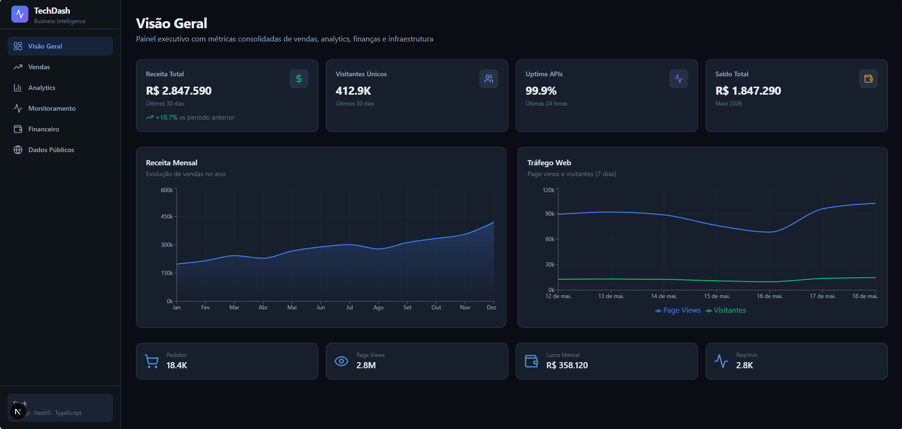
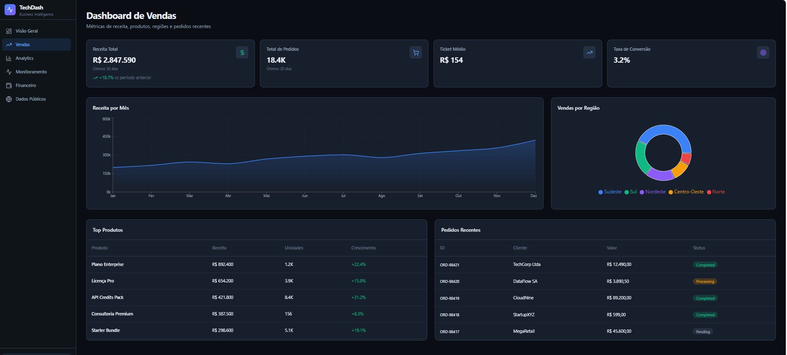
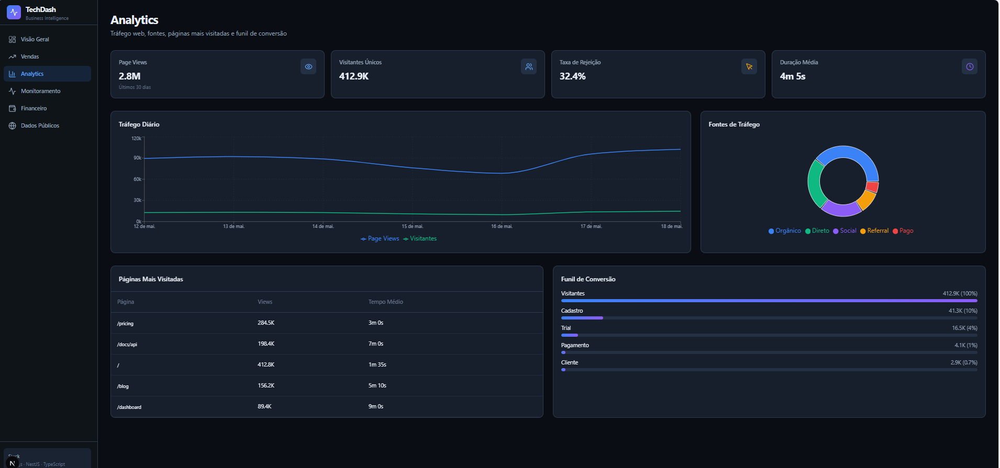
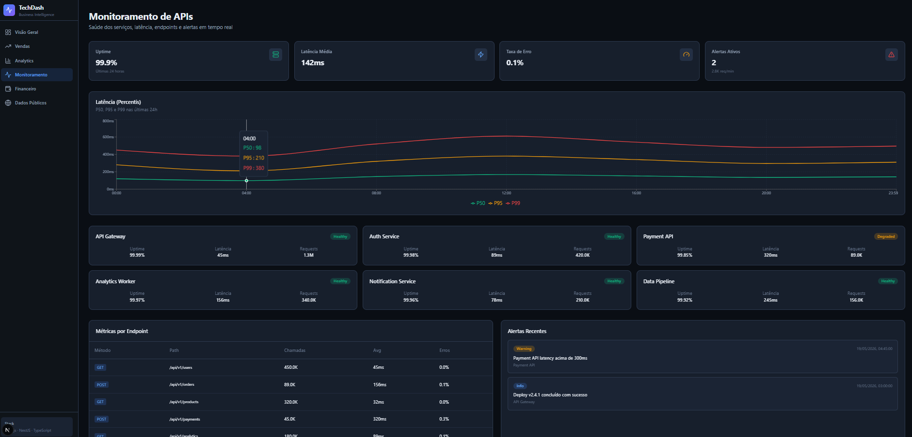
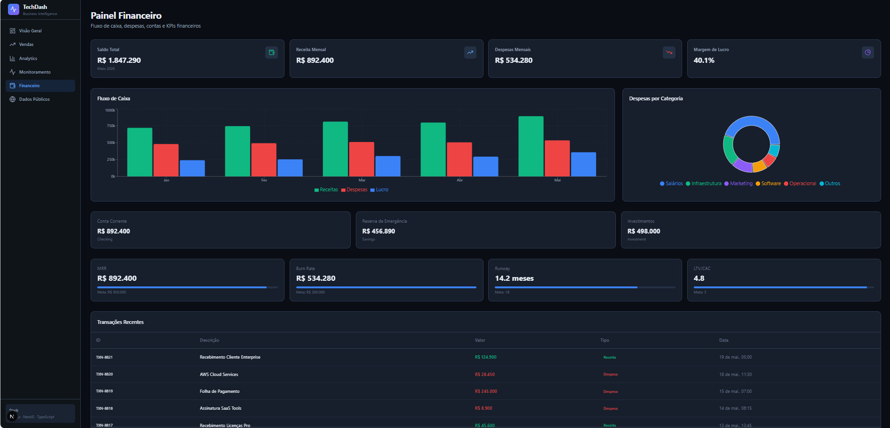
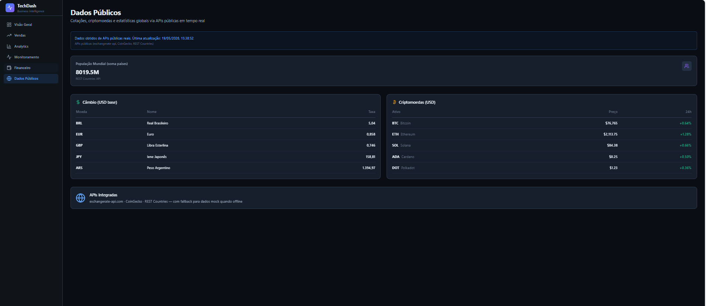

<div align="center">


### Executive BI Dashboard · Next.js + NestJS


<br/>

[](https://brayansilver.github.io)
[](https://github.com/BrayanSilver)
[](https://www.linkedin.com/in/brayan-r-silveira-b80636150/)
[](mailto:brayansilver.teen@gmail.com)


</div>

---

## 📌 Sobre

Painel executivo full-stack para consolidar **vendas, analytics, finanças, monitoramento de APIs** e dados públicos em tempo real. Projeto de portfólio com Next.js 15 + NestJS + TypeScript.

## 📊 Status cards

<div align="center">
  
  
</div>

## 🎬 Demo animada

<div align="center">



</div>

> Slideshow gerado a partir das capturas em `fotosProjeto/`. Para um GIF de tela real (5–8s), grave com ScreenToGif / Gifski e substitua este arquivo.


## 🔄 Arquitetura / fluxo



## ✨ Módulos

| Módulo | Rota | Descrição |
|--------|------|-----------|
| Visão Geral | `/` | KPIs consolidados |
| Vendas | `/vendas` | Receita, produtos, regiões |
| Analytics | `/analytics` | Tráfego e funil |
| Monitoramento | `/monitoramento` | Saúde de APIs e alertas |
| Financeiro | `/financeiro` | Fluxo de caixa |
| Dados Públicos | `/dados-publicos` | Câmbio, crypto, população |


## ▶️ Como rodar

### Backend (porta **3002**)
```bash
cd backend
npm install
npm run start:dev
```
API: `http://localhost:3002/api`

### Frontend (porta **3000**)
```bash
cd frontend
npm install
npm run dev
```
Abra http://localhost:3000

```env
NEXT_PUBLIC_API_URL=http://localhost:3002/api
```


## 🖼️ Galeria

### Visão Geral


### Vendas


### Analytics


### Monitoramento


### Financeiro


### Dados Públicos



---

<div align="center">

**Brayan R. Silveira** · Full Stack Developer

[Portfolio](https://brayansilver.github.io) · [GitHub](https://github.com/BrayanSilver) · [LinkedIn](https://www.linkedin.com/in/brayan-r-silveira-b80636150/)


</div>
